# <h1 align="center"> Recursos⭐ </h1>
<h3 align="center">Un recopilatorio de mis recursos. Todas aquellas páginas web, herramientas y recomendaciones que me ayudaron a aprender y a perfeccionarme. Y si algún día le sirven a alguien mas, habrá cumplido su propósito...</h3>

 <!-- SECCION APRENDER PROGRAMACION + -->

<h2>💻 Aprender PROGRAMACIÓN</h2>

<h4>🌼 Cursos Gratis </h4> 

   • <a href="https://dev.to/devmount/8-games-to-learn-css-the-fun-way-4e0f">Aprender CSS 🎮</a> 
    Este es un artículo que contiene una lista de JUEGOS para aprender CSS. Creeme que sirve 😉  
    Contiene algunos conocidos como Flexbox Froggy, Grid Garden, CSS Diner, entre otros    
   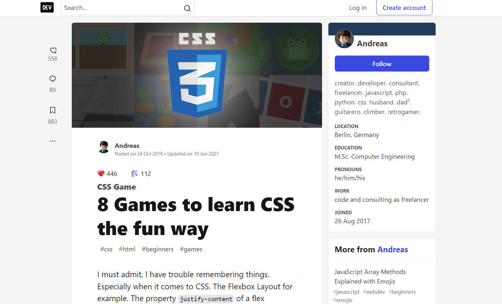     

  • <a href="https://gridcritters.com/">Grid Citters</a> 
  • <a href="https://codingfantasy.com/games/flexboxadventure">Coding Fantasy</a>
  • <a href="https://www.codemonkey.com/">Code Monkey</a>
  • <a href="https://www.codeanalogies.com/csssundae/">CSS Sundae</a>
  • <a href="https://ishadeed.com/article/learn-css-positioning/">CSS Positioning</a>  
    Siguiendo con los JUEGOS 🕹 para aprender a programar, también tenía a mano estos.    
    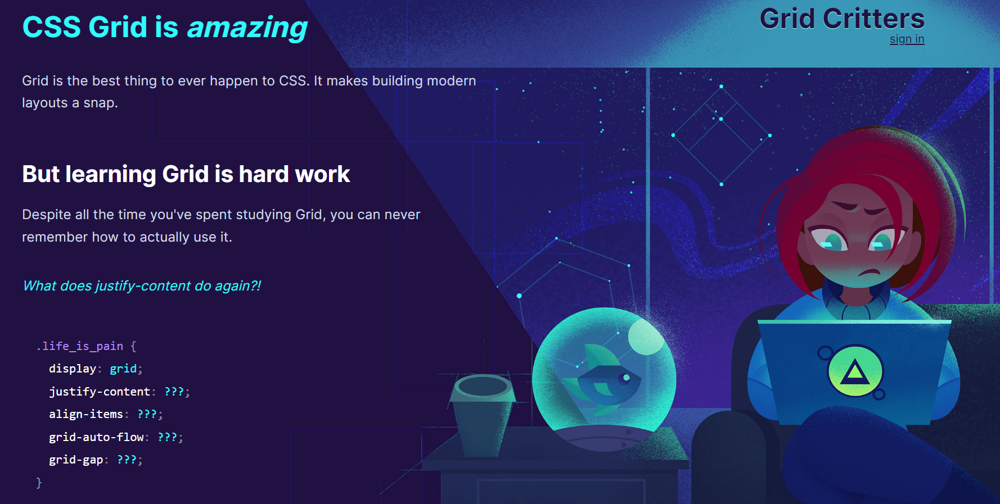  

  • <a href="https://aprendejavascript.org/">Aprende Javascript</a>   
  Si lo tuyo es lo teórico o si buscas buenos resumenes además de videos, este sitio es muy completo     
  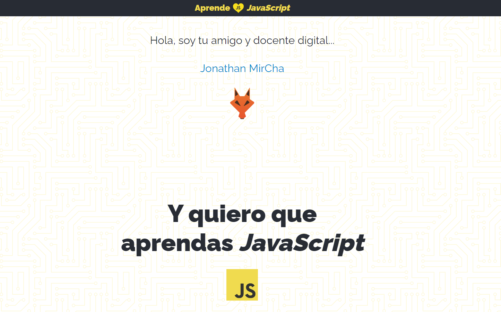    

   • <a href="https://www.freecodecamp.org/">FreeCodeCamp</a> 
   Es una plataforma educativa en línea que proporciona cursos gratuitos de programación y desarrollo web.  
   El objetivo principal de FreeCodeCamp es ayudar a las personas a aprender a programar y desarrollar  
   habilidades en tecnologías web como HTML, CSS, JavaScript, React, Node.js y más.    
  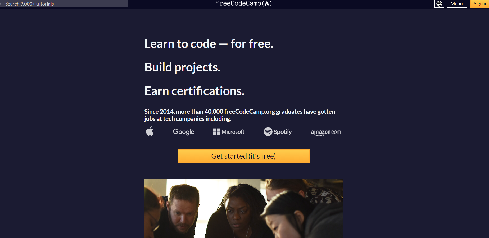  

   • <a href="https://argentinaprograma.com/curso-javascript">Argentina Programa</a>  
  ¿Sabías que Argentina Programa tiene un curso de Javascipt   
  al que podes acceder gratis sin si quiera ser beneficiario de la beca?    
  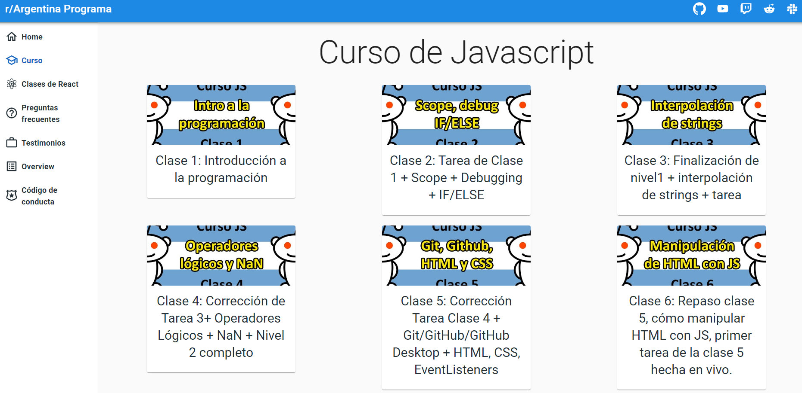  

  • <a href="https://app.edutin.com/category">Edutin</a>  
  Cursos de programación, base de datos y prácticamente de lo que quieras. Esta web  
  recopila distintos videos, recursos y herramientas para poder enseñarte, la variedad que tienen es enorme    
  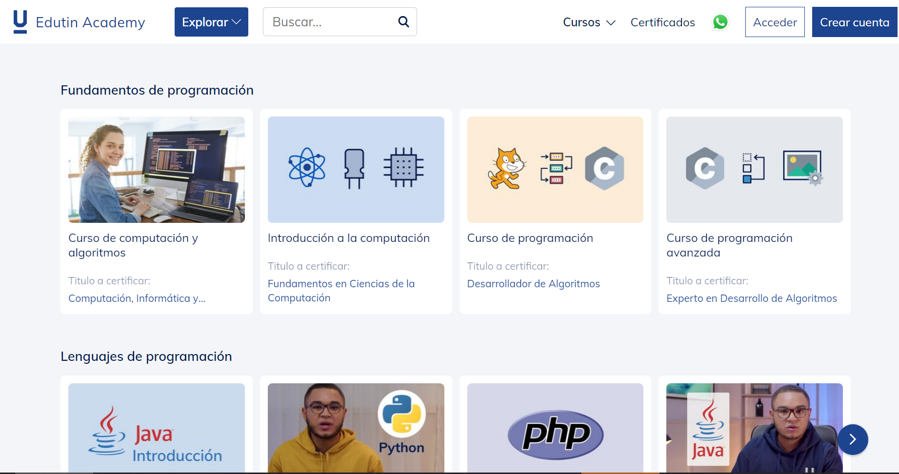  

  • <a href="https://www.theodinproject.com/">The Odin Project</a>  
  Es una comunidad de código abierto dedicada a proporcionar fuentes de información  
  para aprender de cero hasta ser un desarrollador fullstack    
  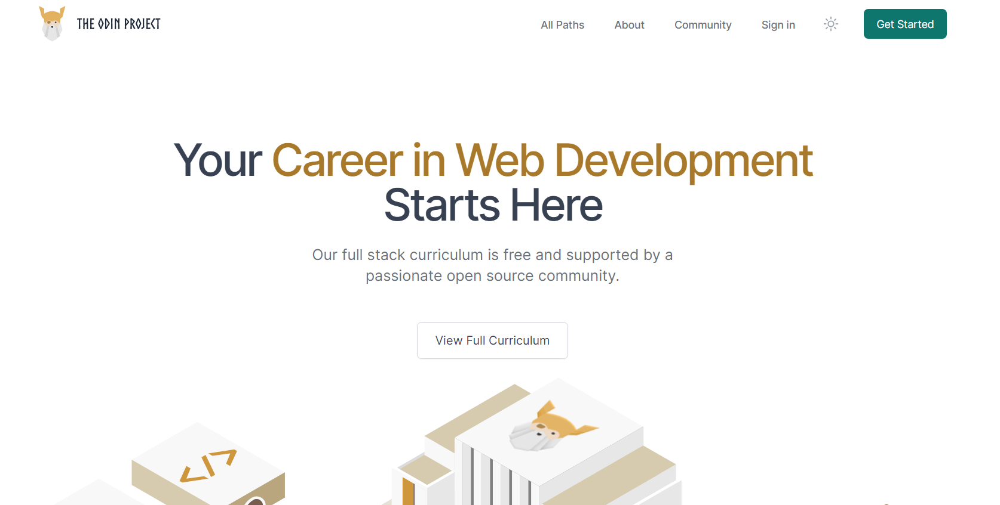  
  
  • <a href="https://www.udemy.com/course/crea-una-landing-page-moderna-con-html-css-y-javascript/">Crea una Landing Page</a>  
  Es un curso gratis en la plataforma de UDEMY donde podemos crear una landing page  
  con HTML, CSS y Javascript. Simple, corto y de práctica.    
  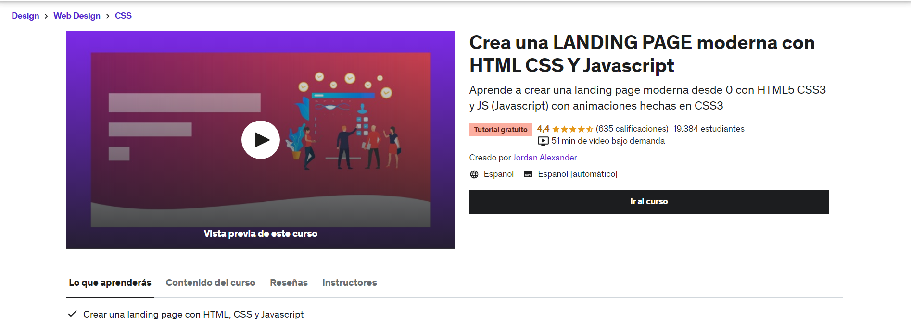  

 • <a href="https://escuelavue.es/">Escuela VUE</a>  
  Cursos de Js Avanzado y VueJS. Cuenta con una comunidad de Discord, 11 cursos y 249 lecciones.    
  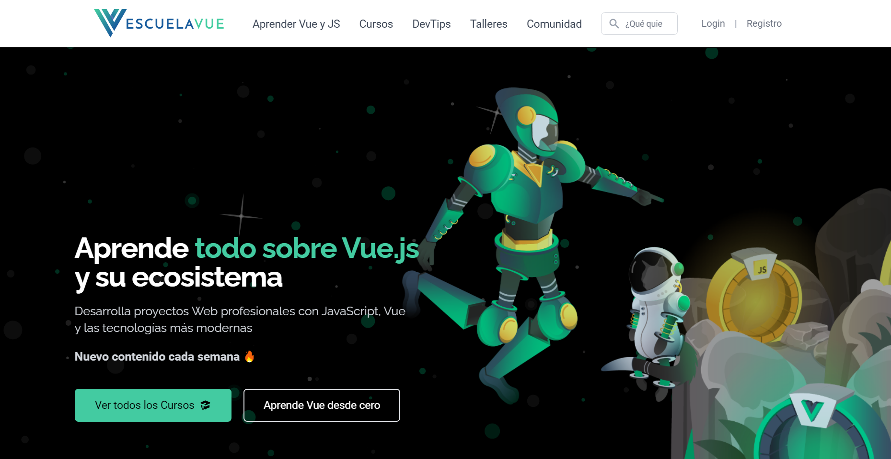  

  • <a href="https://ieeeitba.org.ar/cursospython?utm_source=emBlue&utm_medium=email&utm_campaign=Bienvenida%20Curso%20Introductorio%201Q2022&utm_content=Bienvenida--    Clase%201:%20Curso%20Introducci%C3%B3n%20a%20la%20Programaci%C3%B3n%20IEEE-ITBA&utm_term=multiple--3--none--0-10--ENVIO%20SIMPLE">ITBA - Introductory Python Course</a>  
  Curso gratuito, dictado por la asociación estudiantil del Instituto Tecnológico de Buenos Aires.  
  Es una Introducción a Python. Para acceder a él debes inscribirte en la Edición que se encuentre vigente en ese momento.     
  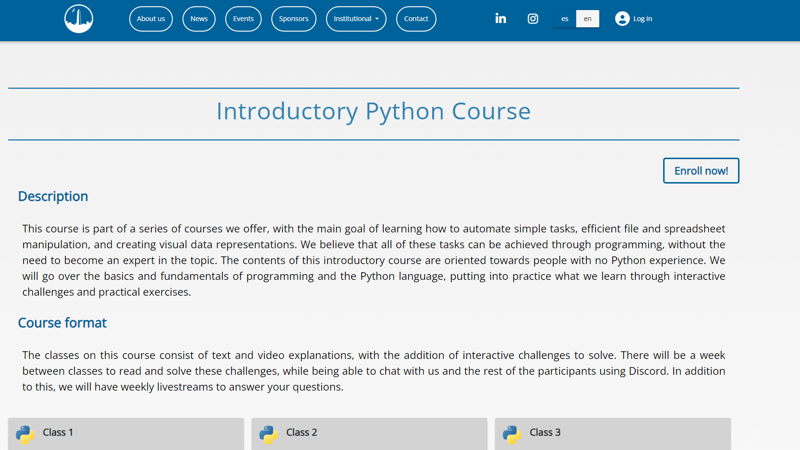   

<!-- Sumar + -->

 <h4>💸 Cursos Pagos </h4> 

  • <a href="https://www.udemy.com/course/javascript-moderno-guia-definitiva-construye-10-proyectos/">Aprendiendo JS MODERNO - Curso MERN - Construye +20 Proyectos</a>  
  Es un curso muy completo en la plataforma de UDEMY que va desde JS básico a JS avanzado.  
  Tiene su parte de Testing (Jest y Cypress), un acercamiento a los patrones de diseño, Express,  
  Bootstrap, Tailwind CSS, una introducción a Vue, React, Mongo DB, Node JS y   
  finaliza con un proyecto MERN que integra todo lo aprendido.    
  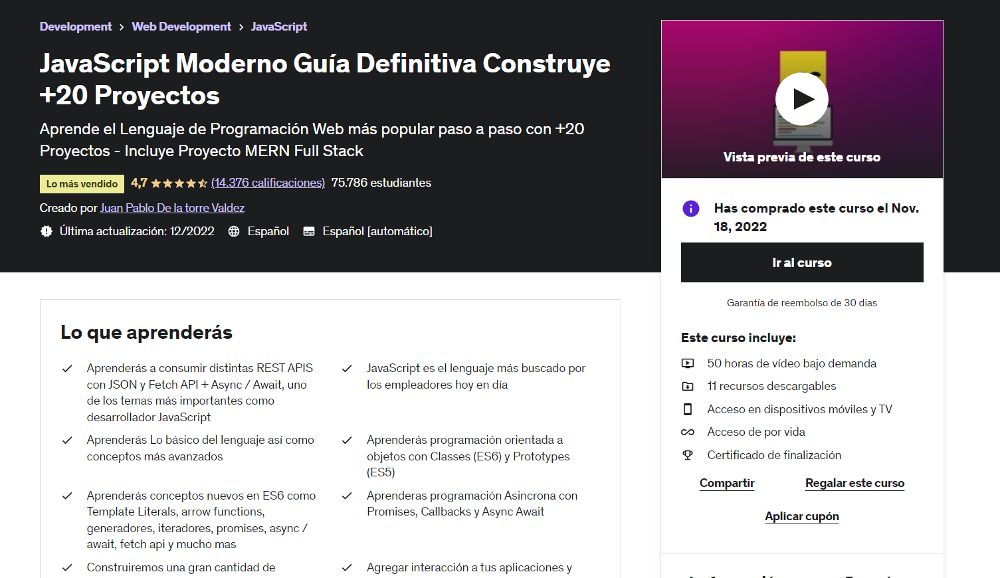 

 <!-- Sumar + -->

<!-- SECCION RECURSOS DE DISEÑO + -->

<h2>🌈 Recursos de Diseño </h2>

  

   
  
✏ Páginas de edición en general

   
   • <a href="https://new.express.adobe.com/">Adobe Express</a>   
  Su versión gratuita es bastante completa y es para siempre,  te ayuda a crear    
 CONTENIDO DESTACABLE para redes sociales, páginas web, etc (folletos, logotipos, banners)      
  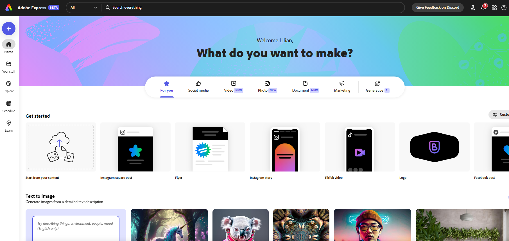      

  • <a href="https://10015.io/">10015 Tools</a>   
  Se trata de una Caja de Herramientas que cuenta con herramientas de texto, de imagenes,  
  de CSS, de código, de color, de redes sociales, entre otras    
  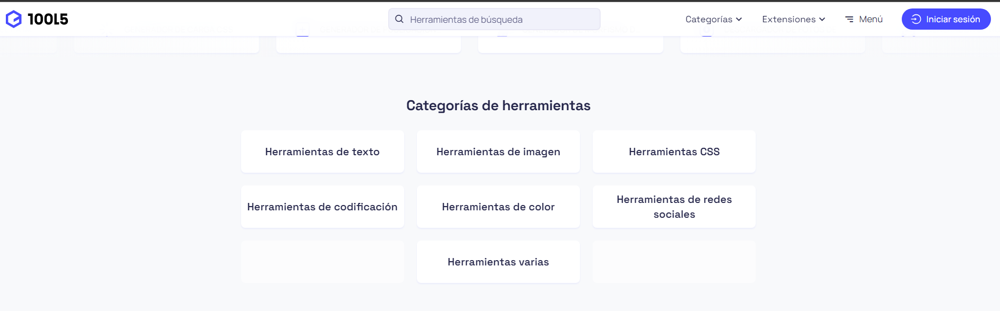       

  • <a href="https://dribbble.com/shots">Dribble (Darle enter al link, cuando tire el 404)</a>   
  Una página que puede servir de MUSA. De fuente de inspiración ya que aloja los porfolios  
  y diseños de distintas agencias  y creadres de contenido del mundo.   
  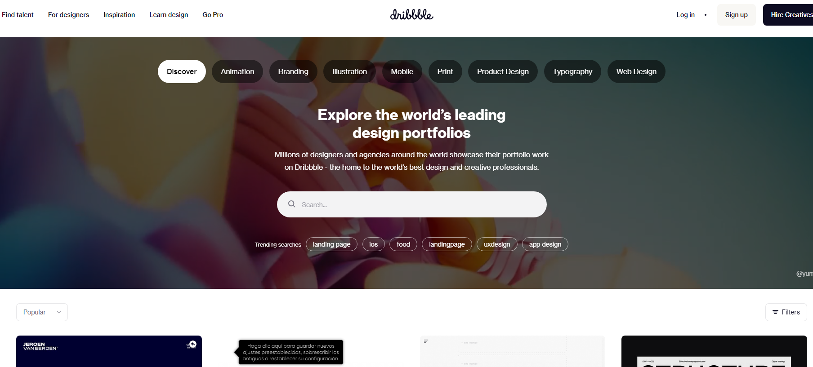     

  

  
   

   
  
🎨 Colores

  
    
   • <a href="https://www.color-hex.com/">Color - Hex</a>   
  Brinda información sobre los colores , incluidos los modelos de color   
  (RGB, HSL, HSV y CMYK), colores triádicos, colores monocromáticos y colores   
  análogos calculados en la página de color.     
  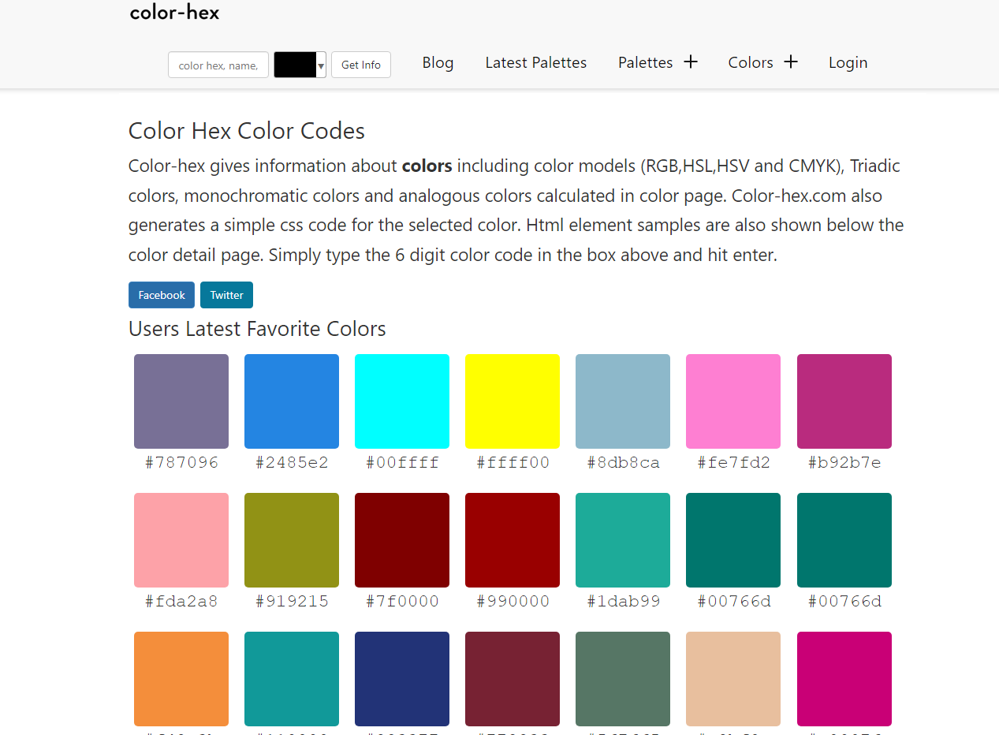     

   • <a href="https://colorhunt.co/">Color Hunt</a> • <a href="http://colorsafe.co/">Color Safe</a> • <a href="https://flatuicolors.com/">Flat UI Colors</a>    
  Gran colección de paleta de colores     
  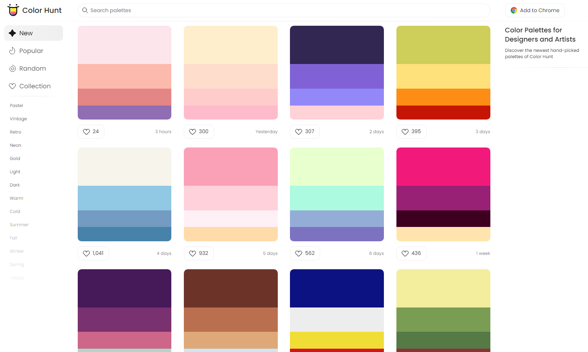     

  • <a href="https://copypalette.app/">Copy Palette</a> • <a href="https://coolors.co/">Coloors</a>    
  Generador de paleta de colores y gradientes     
  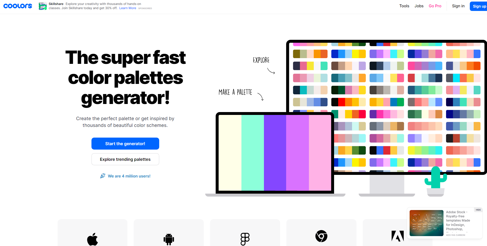     

   • <a href="https://cssgradient.io/">Css Gradient</a>   • <a href="https://webgradients.com/">Web Gradients</a>    
  Generador de gradientes de colores      
  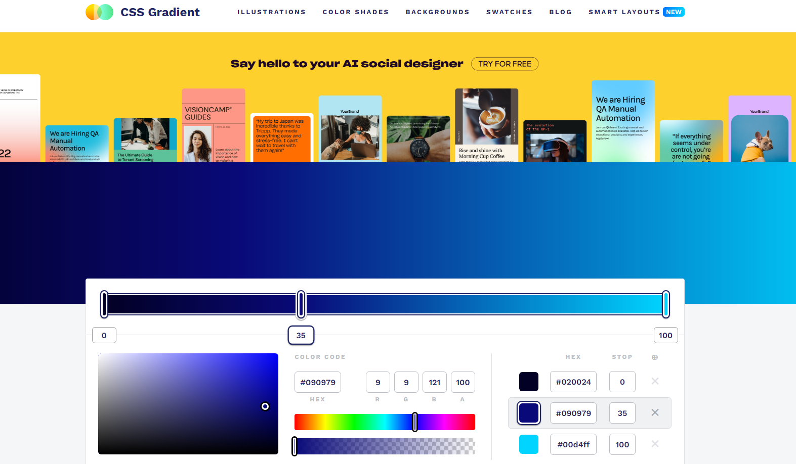     

   • <a href="https://picular.co/">Picular</a>  
  Le decís una palabra (la que sea) y trae colores relacionados o asociados     
  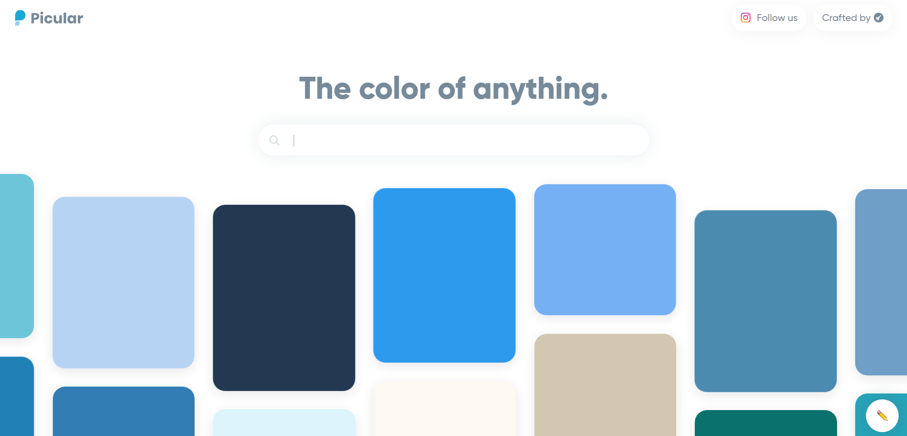     

  

   

   
  
🎞 Imagenes

  Contenido de la sección 2.

  Puedes agregar cualquier texto, imágenes, enlaces o cualquier otro contenido aquí.

  

  
   

   
  
Texto

  Contenido de la sección 2.

  Puedes agregar cualquier texto, imágenes, enlaces o cualquier otro contenido aquí.

  

   

   
  
Iconos

  Contenido de la sección 2.

  Puedes agregar cualquier texto, imágenes, enlaces o cualquier otro contenido aquí.

  

   

   
  
Video

  Contenido de la sección 2.

  Puedes agregar cualquier texto, imágenes, enlaces o cualquier otro contenido aquí.

  

   

   
  
Audios

  Contenido de la sección 2.

  Puedes agregar cualquier texto, imágenes, enlaces o cualquier otro contenido aquí.

  

  
  

   
  
Otros

  Contenido de la sección 2.

  Puedes agregar cualquier texto, imágenes, enlaces o cualquier otro contenido aquí.

  

<!-- Seccion Roadmap -->
 

   

 <h2> Crear tu propio camino ninja 🦊🍥🍜 </h2> 

Contenido de la sección 2.

Puedes agregar cualquier texto, imágenes, enlaces o cualquier otro contenido aquí.

<!-- Seciion Patrones de Diseño -->
 

   

 <h2> Aprender Patrones de Diseño </h2> 

Contenido de la sección 2.

Puedes agregar cualquier texto, imágenes, enlaces o cualquier otro contenido aquí.

<!-- Seciion Practica hasta que se te caigan los ojos -->
 

   

 <h2> Canales y Páginas para PRACTICAR hasta el hartazgo </h2> 

 
 • <a href="https://www.faztweb.com/">Fazt.dev</a>   
  Tiene 586 tutoriales donde te enseña distintos lenguajes, librerías, frameworks por medio de la práctica,  
  diseñando muchas veces proyectos que estan muy estéticos para presentar.    
  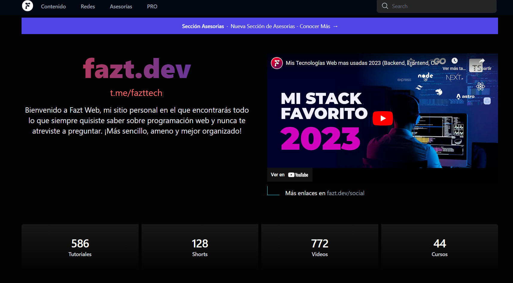    

 • <a href="https://devchallenges.io/">Dev Challenges</a>  
  Challenges para desarrollar. Hay challenges para dominar el diseño responsive, frontend o fullstack.    
  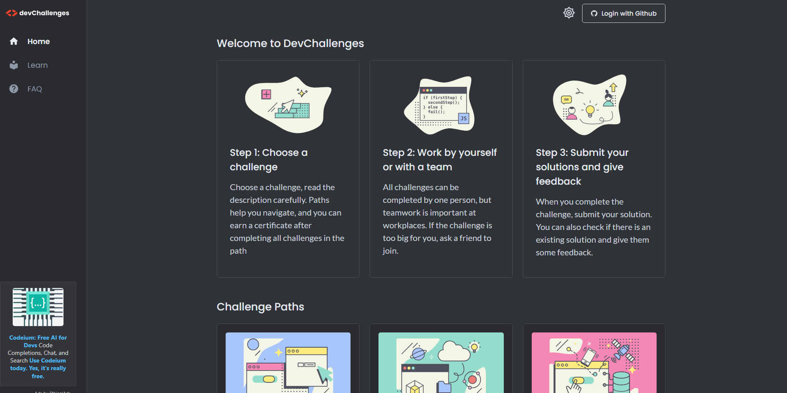    

   • <a href="https://www.frontendmentor.io/challenges">FrontEnd Mentor</a>  
  Challenges para desarrollar de Frontend. Hay challenges categorizados en Junior, Intermediate o Advanced.    
  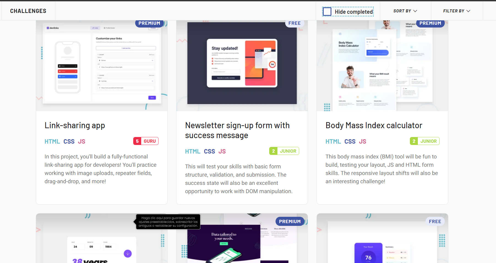    

  • <a href="https://www.youtube.com/c/DorianDesings/videos">Dorian Desings</a>  
  Un amante del CSS que explica con paciencia y ganas, algo que se nota que adora.    
  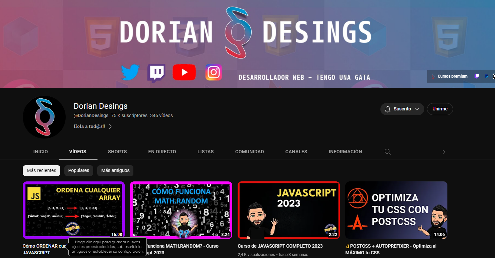    

<!-- Section Documentaciones -->
 

   

  <h2> Documentaciones </h2> 

 
 • <a href="https://www.w3schools.com/">W3Schools</a>  
  Documentación sobre HTML, CSS, JS, SQL, PYTHON, JAVA, PHP, BOOTSTRAP, C, C++,   
  C#, REACT, R, JQUERY, DJANGO, TYPESCRIPT, NODEJS, MYSQL.    
  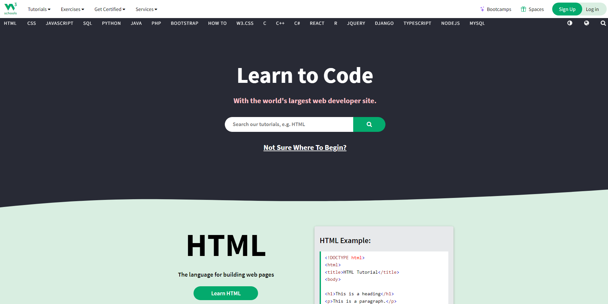  

<!-- Seciion Entrevistas -->
 

   

  <h2> Preguntas de Entrevista </h2> 

Contenido de la sección 2.

Puedes agregar cualquier texto, imágenes, enlaces o cualquier otro contenido aquí.

<!-- Seciion APIS -->
 

   

  <h2> APIS </h2> 

 
  • <a href="https://github.com/public-apis/public-apis">Public Apis</a>  
  Una lista colectiva de API gratuitas para usar en software y desarrollo web    
 

<!-- Seciion Librerías -->
 

   

  <h2> Librerías </h2> 

<!-- Seciion Otras -->
 

   

  <h2> Otras herramientas </h2> 

 
• <a href="https://chat.openai.com/auth/login">ChatGPT</a>   
  ¿Y cómo no mencionarlo? Si se usa para bien y limitadamente. Aprender a hacer buenos prompts  
  puede ayudarte no sólo en un momento de "traba" sino que puedes aprender mucho, incluso pedirle que  
  te haga pruebas, entrevistas, examenes, te de ejemplos de todo tipo.   
  Es una gran herramienta de aprendizaje y práctica    
  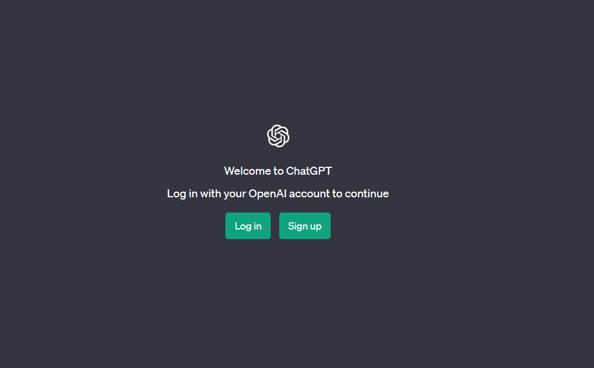    

• <a href="https://www.deepl.com/translator">DeepL</a>   
  Un traductor de idiomas que admite texto    
  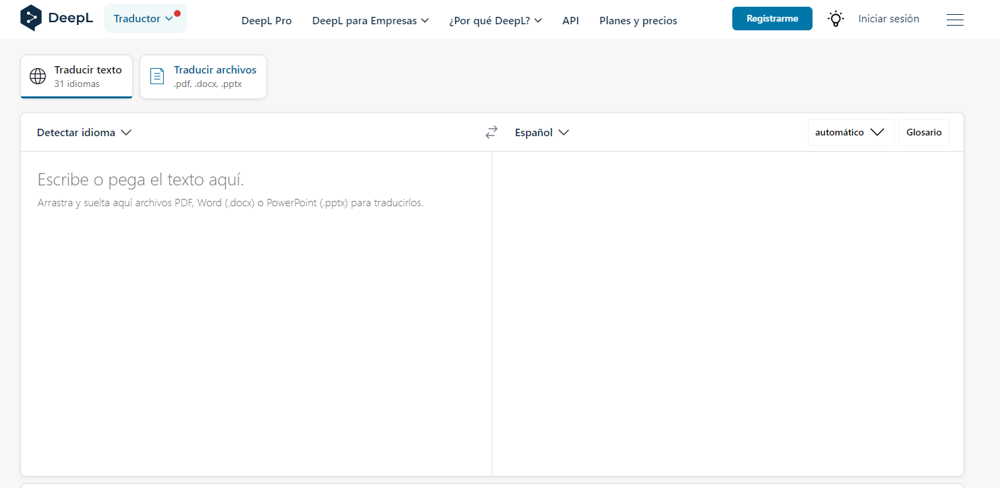    

  • <a href="http://static.socraticarts.com/AjaxTester/">Ajax Tester</a>   
  Una página simple para experimentar con las llamadas AJAX. Para ello hay que especificar   
  el método HTTP, la URL y los parámetros, y hacer clic en Solicitud Ajax 👌    
      

